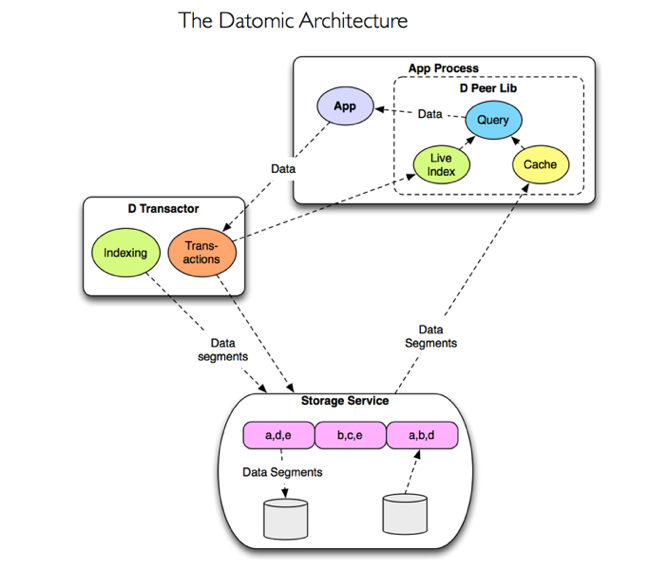
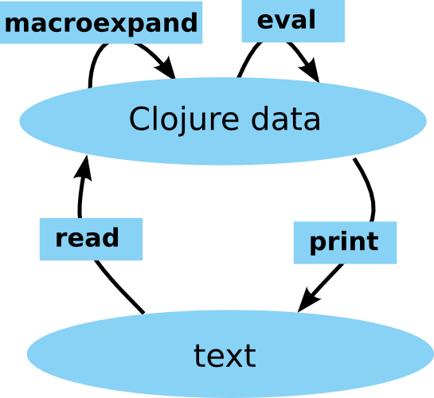
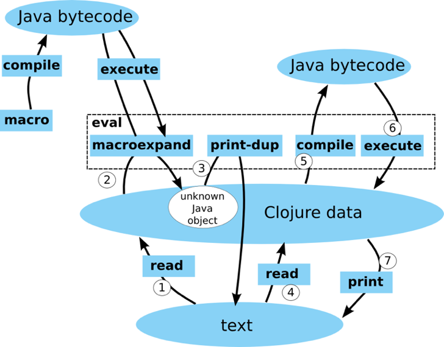

!SLIDE 
# Clojure/West 2012 #

### by Ted Naleid ###

!SLIDE

3 Speaker Tracks 

(roughly: Production/Usage, Core Language/Library, Grab Bag/Esoterica)

!SLIDE
## Key Themes/Things Overheard 

!SLIDE
# Libraries not Frameworks

!SLIDE 

# Alternative Testing

Generative Testing

 

tests emit more than pass/fail (ex: documentation) 

 

reminded me of Fitness testing

!SLIDE

# Datomic

!SLIDE

## Datomic Keynote - Rich Hickey ##

and

## Evident Code at Scale - Stuart Holloway ##

!SLIDE

Datomic comes out of Rich Hickey's reading of 

"Out of the Tar Pit" - Moseley and Marks 2006

!SLIDE

Peer Library - embedded in your application

!SLIDE

Peer talks to Transactor which accepts transactions and processes them serially

!SLIDE center

# Datomic Architecture #

!SLIDE

Currently runs on top of Amazon's DynamoDB

(will target other platforms in the future)

!SLIDE

A database instance is immutable, enables heavy caching

!SLIDE 

Query engine is datalog

(a declarative lanugage, rules and data patterns)

!SLIDE
You can invoke your code from queries

!SLIDE

Deals in Facts 

not Place Oriented Programming (PLOP) 

!SLIDE
"fundamental move away from places, places destroy a value"

!SLIDE
Datom

Entity/Attribute/Value/Transaction (E/A/V/Tx)

Similar storage to RDF (subject, predicate, object)

!SLIDE 

"It's like Starcraft; as you move around you see more of the map."

"Over time, your database is like this: As you run your business, you discover more of the data"

!SLIDE

## Macros are Hard - David McNeil ##

!SLIDE
Goes over the things you need to internalize when working with macros

!SLIDE
You can get away with copy/paste for a while, but you'll eventually get bit without deeper understanding

!SLIDE

Go back to basics and understand how the reader works

    <a href="http://clojure.org/reader">http://clojure.org/reader</a>

!SLIDE center

Naive Macro Understanding

!SLIDE center

Realistic Macro Understanding

          
!SLIDE

## Real World Cascalog - Federico Brubacher ##

!SLIDE

Declarative Datalog-inspired syntax on top of Cascading

!SLIDE
Cascading is thin layer on top of Hadoop's Map/Reduce for defining tuple data pipes

!SLIDE
Pipes are fed by a Source Tap which connects a number of Operations to a Sink Tap

Operations are map side (filtering and transforming tuples) and reduce side (grouping and aggregation)

!SLIDE 

## Storm - Nathan Marz ##

!SLIDE

Realtime computation replacement for batch systmes like Hadoop

!SLIDE

Topologies made of Spouts (streams of tuples) and Bolts (operations on streams)

!SLIDE

Just added Distributed RPC capabilities

!SLIDE

## ClojureScript Anatomy - Michael Fogus ##

!SLIDE

One of a number of presentations on ClojureScript

!SLIDE
ClojureScript work is being leveraged to emit languages other than JavaScript

!SLIDE

## Programming with Values in Clojure - Alan Dipert ##

!SLIDE

Start to see the "shapes" of data

One of a number of talks that advises you to "change how you think" when working with clojure

!SLIDE
Brainfuck to Clojure compiler

<pre>
+++++[->+<]
</pre>

<pre>
+ + + + + [ - > + < ]
</pre>

<pre>
(read-string "(+ + + + + [ - > + < ])")    
</pre>

The brainfuck language emulates the tape in a Turing machine

!SLIDE

## What Sucks About Clojure (and why you'll love it anyway) - Chas Emerick ##

!SLIDE
If you're considering using clojure, in 18 months what will you wish you'll know now

!SLIDE

* Namespaces
* `declare`
* Dynamic scope
* Using STM (effectively) is hard
* You will read Clojure's source
* The JVM
* AOT Compilation
* (((OMG the parens)))
* Over-enthusiasm
* Big ball of mud/stacktraces
* Rich Hickey Bus Factor 

!SLIDE

## Why Prismatic Goes Faster With Clojure - Bradford Cross ##

!SLIDE

Inspiring presentation with more than a dash of NIH syndrome

!SLIDE
## Where to find more ##

!SLIDE

Many slides on github

<a href="https://github.com/strangeloop/clojurewest2012-slides">https://github.com/strangeloop/clojurewest2012-slides</a>

!SLIDE

All presentations recorded and will be slowly released on DZone

Follow the <a href="https://twitter.com/#!/clojurewest">@ClojureWest</a> twitter account for release dates

!SLIDE

Questions?
